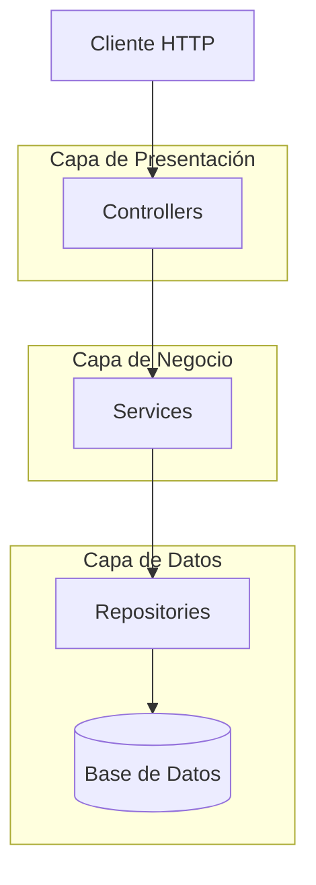
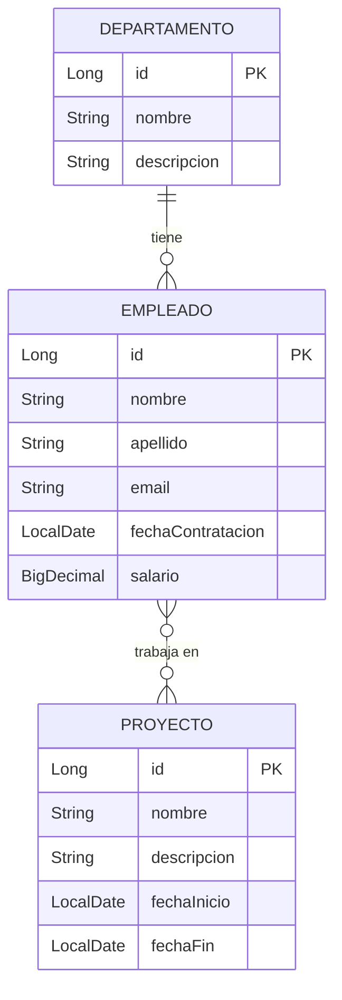
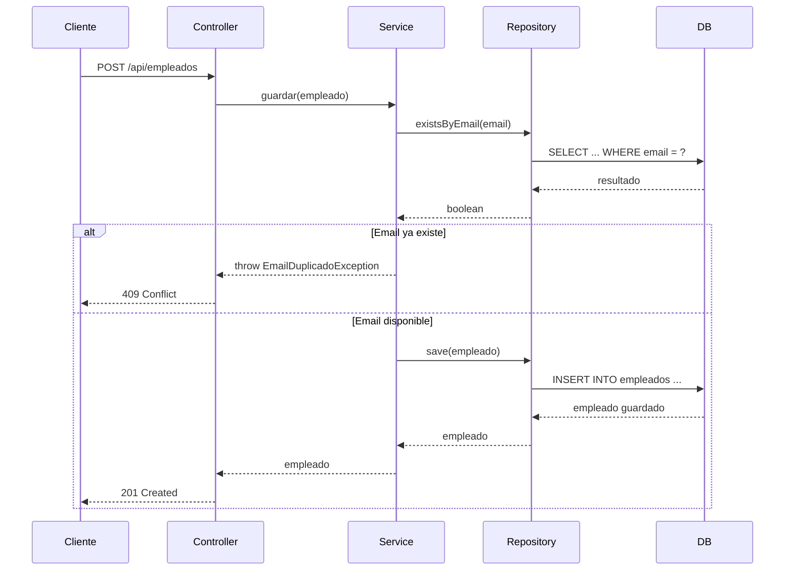

# Prompts de Documentación

## Prompt 1: Documentación de endpoints REST API

### Prompt Utilizado:
```
Necesito crear una documentación clara de los endpoints REST de mi sistema de gestión de empleados. La API tiene estos controladores:
- EmpleadoController: CRUD + búsquedas por departamento, email, salario
- DepartamentoController: CRUD + gestión de empleados, estadísticas
- ProyectoController: CRUD + gestión de empleados, filtros por estado

¿Cómo debería estructurar esta documentación para el README.md del proyecto?
```

### Respuesta Recibida:
```markdown
## 📚 Documentación de API REST

### Empleados

#### Obtener todos los empleados
```
GET /api/empleados
```
**Respuesta**: Lista de empleados
**Código**: 200 OK

#### Obtener un empleado por ID
```
GET /api/empleados/{id}
```
**Parámetros**:
- `id`: ID del empleado

**Respuesta**: Empleado encontrado
**Código**: 200 OK | 404 Not Found

#### Crear un empleado
```
POST /api/empleados
```
**Body**:
```json
{
  "nombre": "Juan",
  "apellido": "Pérez",
  "email": "juan.perez@empresa.com",
  "fechaContratacion": "2023-01-15",
  "salario": 50000.00
}
```

**Respuesta**: Empleado creado
**Código**: 201 Created | 400 Bad Request | 409 Conflict
```

### Modificaciones Realizadas:
- Organicé la documentación por controlador para mejor navegación
- Agregué ejemplos de JSON para requests y responses
- Incluí todos los códigos de respuesta posibles
- Añadí descripciones de parámetros y su tipo
- Estructuré con formato Markdown para mejor legibilidad en GitHub

### Explicación del Prompt:
Una documentación clara de la API es esencial para que otros desarrolladores puedan utilizarla correctamente. La estructura debe ser intuitiva y los ejemplos deben ser representativos.

### Aprendizajes Obtenidos:
- La documentación debe incluir URL, método HTTP, parámetros y cuerpo
- Los ejemplos de JSON ayudan a entender el formato esperado
- Es importante documentar todos los posibles códigos de respuesta
- La organización por recurso (Empleado, Departamento, Proyecto) es intuitiva
- El formato Markdown es ideal para documentación en GitHub
- Los parámetros opcionales deben indicarse claramente
- La documentación debe mantenerse actualizada con los cambios en la API

---

## Prompt 2: Creación de diagramas de arquitectura

### Prompt Utilizado:
```
Necesito crear diagramas para documentar la arquitectura de mi sistema de gestión de empleados. Quiero incluir:
- Diagrama de capas (Controller, Service, Repository, Model)
- Diagrama de entidades y relaciones
- Diagrama de secuencia para operaciones clave
- Diagrama de despliegue con Docker

¿Cómo puedo crear estos diagramas usando Mermaid para incluirlos en el README.md?
```

### Respuesta Recibida:
```markdown
## 📊 Diagramas de Arquitectura

### Diagrama de Capas


### Diagrama de Entidades


### Diagrama de Secuencia

```

### Modificaciones Realizadas:
- Simplifiqué los diagramas para mayor claridad
- Incluí solo las entidades y relaciones principales
- Mantuve los diagramas de secuencia enfocados en flujos clave
- Usé la sintaxis correcta de Mermaid para GitHub

### Explicación del Prompt:
Los diagramas visuales ayudan enormemente a entender la arquitectura y flujos de un sistema. Mermaid permite incluir diagramas directamente en Markdown, lo que es ideal para documentación en GitHub.

### Aprendizajes Obtenidos:
- Mermaid es una excelente herramienta para diagramas en Markdown
- Los diagramas deben ser simples pero informativos
- El diagrama de capas muestra la separación de responsabilidades
- El diagrama ER visualiza las relaciones entre entidades
- Los diagramas de secuencia ilustran flujos complejos
- Los diagramas de despliegue muestran la infraestructura
- La documentación visual complementa la textual
- GitHub renderiza diagramas Mermaid directamente en el README

---

## Prompt 3: Documentación de configuración de profiles

### Prompt Utilizado:
```
Necesito documentar la configuración de profiles de Spring Boot para mi sistema:
- Profile dev con H2 para desarrollo
- Profile mysql para MySQL con Docker
- Profile postgres para PostgreSQL con Docker
- Profile test para pruebas unitarias

¿Cómo debería estructurar esta documentación para que otros desarrolladores puedan entenderla fácilmente?
```

### Respuesta Recibida:
```markdown
## 🔧 Configuración de Profiles

El sistema utiliza diferentes profiles de Spring Boot para adaptarse a distintos entornos:

### Profile `dev` (Desarrollo)
Utiliza H2 en memoria para desarrollo rápido sin dependencias externas.

```bash
# Ejecutar con profile dev
./mvnw spring-boot:run -Dspring-boot.run.profiles=dev
```

**Características**:
- Base de datos H2 en memoria
- Consola H2 disponible en http://localhost:8080/h2-console
- Esquema recreado en cada inicio (ddl-auto: create-drop)
- Logging detallado de SQL
- Ideal para desarrollo local rápido

### Profile `mysql` (MySQL)
Conecta a un servidor MySQL, por defecto usando Docker.

```bash
# Iniciar contenedor MySQL
docker compose up -d mysql

# Ejecutar con profile mysql
./mvnw spring-boot:run -Dspring-boot.run.profiles=mysql
```

**Características**:
- Conexión a MySQL en localhost:3306
- Esquema actualizado automáticamente (ddl-auto: update)
- Datos persistentes entre reinicios
- Requiere contenedor Docker o servidor MySQL

### Profile `postgres` (PostgreSQL)
Conecta a un servidor PostgreSQL, por defecto usando Docker.

```bash
# Iniciar contenedor PostgreSQL
docker compose up -d postgres

# Ejecutar con profile postgres
./mvnw spring-boot:run -Dspring-boot.run.profiles=postgres
```

**Características**:
- Conexión a PostgreSQL en localhost:5432
- Esquema actualizado automáticamente (ddl-auto: update)
- Datos persistentes entre reinicios
- Requiere contenedor Docker o servidor PostgreSQL

### Profile `test` (Testing)
Configuración específica para pruebas automatizadas.

```bash
# Las pruebas usan este profile automáticamente
./mvnw test
```

**Características**:
- Base de datos H2 en memoria
- Esquema recreado para cada test (ddl-auto: create-drop)
- Optimizado para velocidad de pruebas
- No requiere dependencias externas
```

### Modificaciones Realizadas:
- Agregué comandos específicos para ejecutar cada profile
- Incluí características clave de cada configuración
- Organicé por profile para fácil referencia
- Mantuve un formato consistente para cada sección

### Explicación del Prompt:
La documentación de profiles es crucial para que otros desarrolladores puedan entender cómo configurar y ejecutar la aplicación en diferentes entornos.

### Aprendizajes Obtenidos:
- Los comandos específicos facilitan la ejecución en cada entorno
- Es importante destacar las diferencias clave entre profiles
- La documentación debe incluir requisitos previos (Docker)
- Los comandos deben ser copiables directamente
- La organización por profile facilita la navegación
- Las características específicas ayudan a entender el propósito de cada profile
- La documentación debe ser clara incluso para desarrolladores nuevos en el proyecto

---

## Prompt 4: Instrucciones de instalación y ejecución

### Prompt Utilizado:
```
Necesito crear instrucciones claras de instalación y ejecución para mi sistema de gestión de empleados. Deben incluir:
- Requisitos previos (Java, Maven, Docker)
- Pasos para clonar el repositorio
- Instrucciones para compilar el proyecto
- Comandos para ejecutar con diferentes profiles
- Instrucciones para acceder a la API
- Pasos para ejecutar pruebas

¿Cómo debería estructurar estas instrucciones para el README.md?
```

### Respuesta Recibida:
```markdown
# 🚀 Sistema de Gestión de Empleados

## Requisitos Previos
- Java 17 o superior
- Maven 3.8.0 o superior (o usar el wrapper incluido)
- Docker y Docker Compose (para MySQL y PostgreSQL)

## 📥 Instalación

### 1. Clonar el repositorio
```bash
git clone https://github.com/usuario/sistema-gestion-empleados.git
cd sistema-gestion-empleados
```

### 2. Compilar el proyecto
```bash
./mvnw clean package -DskipTests
```

## 🏃‍♂️ Ejecución

### Modo Desarrollo (H2 en memoria)
```bash
./mvnw spring-boot:run -Dspring-boot.run.profiles=dev
```
La API estará disponible en http://localhost:8080
Consola H2: http://localhost:8080/h2-console

### Modo MySQL
```bash
# Iniciar contenedor MySQL
docker compose up -d mysql

# Esperar a que MySQL esté listo (10-15 segundos)
# Luego ejecutar la aplicación
./mvnw spring-boot:run -Dspring-boot.run.profiles=mysql
```

### Modo PostgreSQL
```bash
# Iniciar contenedor PostgreSQL
docker compose up -d postgres

# Esperar a que PostgreSQL esté listo (10-15 segundos)
# Luego ejecutar la aplicación
./mvnw spring-boot:run -Dspring-boot.run.profiles=postgres
```

## 🧪 Ejecutar Pruebas
```bash
# Ejecutar todas las pruebas
./mvnw test

# Ejecutar pruebas de una clase específica
./mvnw test -Dtest=EmpleadoServiceTest

# Ejecutar pruebas con cobertura
./mvnw test jacoco:report
```
El informe de cobertura estará disponible en `target/site/jacoco/index.html`
```

### Modificaciones Realizadas:
- Organicé las instrucciones en secciones claras
- Incluí emojis para mejor navegación visual
- Agregué comandos específicos para cada escenario
- Incluí información sobre dónde acceder a la API
- Mantuve los comandos simples y copiables

### Explicación del Prompt:
Unas instrucciones claras de instalación y ejecución son fundamentales para que cualquier desarrollador pueda comenzar a trabajar con el proyecto rápidamente.

### Aprendizajes Obtenidos:
- Las instrucciones deben ser paso a paso y fáciles de seguir
- Los comandos deben ser copiables directamente
- Es importante mencionar todos los requisitos previos
- Los emojis mejoran la navegación visual en Markdown
- Las instrucciones deben cubrir todos los escenarios comunes
- La organización por secciones facilita la referencia
- Incluir información sobre cómo verificar que todo funciona correctamente
- Mencionar tiempos de espera aproximados para procesos lentos

---
